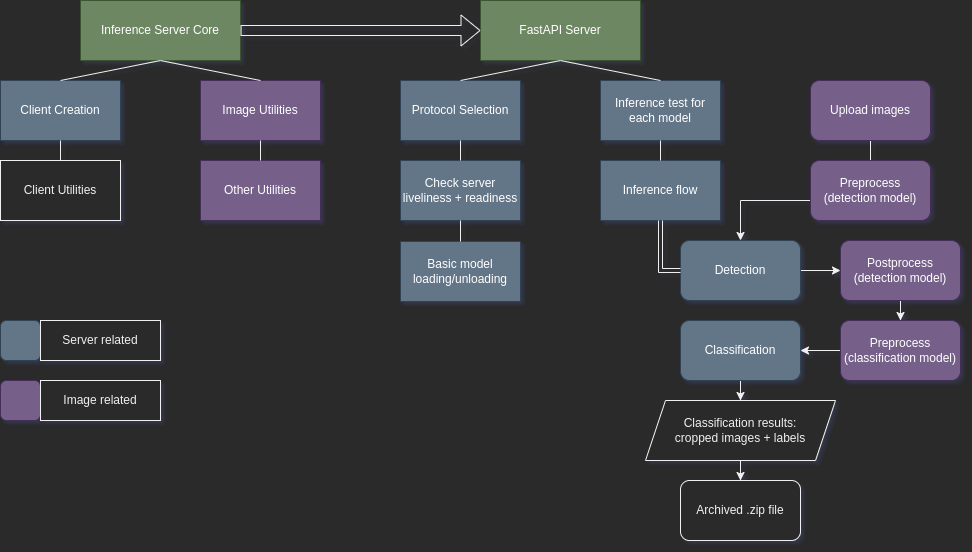

## Triton Inference Server client
This is a small FastAPI server for interacting with Triton Inference Server, using the Triton Client library.

## Installation
- Clone the repository.
- Run the following command from the cloned repo.
```bash
pip install -r requirements.txt
```

## Directory structure
```
controller-temp
 ┣ dog-pics
 ┃ ┣ puggle_084828.jpg
 ┃ ┗ springer_3006.jpg
 ┣ inferencecore
 ┃ ┣ __init__.py
 ┃ ┣ clientcore.py
 ┃ ┣ clientutils.py
 ┃ ┣ imgutils.py
 ┃ ┗ utils.py
 ┣ .gitignore
 ┣ README.md
 ┣ __init__.py
 ┣ requirements.txt
 ┣ server.py
 ┗ vars.py
```

## Project structure
